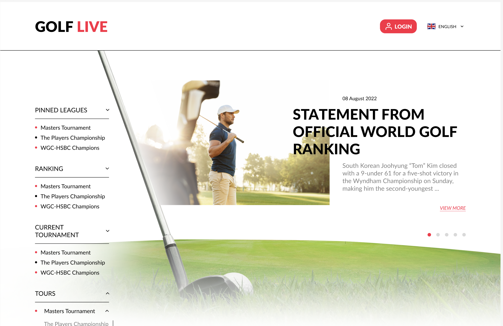

# Golf Live Interface


## Getting Started

First, run the development server:

```bash
npm run dev
# or
yarn dev
```

Open [http://localhost:3000](http://localhost:3000) with your browser to see the result.

You can start editing the page by modifying `pages/index.js`. The page auto-updates as you edit the file.

[API routes](https://nextjs.org/docs/api-routes/introduction) can be accessed on [http://localhost:3000/api/hello](http://localhost:3000/api/hello). This endpoint can be edited in `pages/api/hello.js`.

The `pages/api` directory is mapped to `/api/*`. Files in this directory are treated as [API routes](https://nextjs.org/docs/api-routes/introduction) instead of React pages.

## Learn More

To learn more about Next.js, take a look at the following resources:

- [Next.js Documentation](https://nextjs.org/docs) - learn about Next.js features and API.
- [Learn Next.js](https://nextjs.org/learn) - an interactive Next.js tutorial.

You can check out [the Next.js GitHub repository](https://github.com/vercel/next.js/) - your feedback and contributions are welcome!

## Requirement

- Local Environment must have:
    + Node JS > 16

- Knowledge must have
    + React, Tailwind, Styled Component

## Document Reference
  - [React](https://reactjs.org/docs/getting-started.html)
  - [Tailwind](https://tailwindcss.com/docs/installation)
  - [Styled Component](https://styled-components.com/docs)
  - [SWR](https://swr.vercel.app/docs/getting-started)
  - [react-hooks-global-state](https://github.com/dai-shi/react-hooks-global-state)
  - [Frame Motion](https://www.framer.com/docs/)
  - [GraphQL](https://www.apollographql.com/docs/react/)
